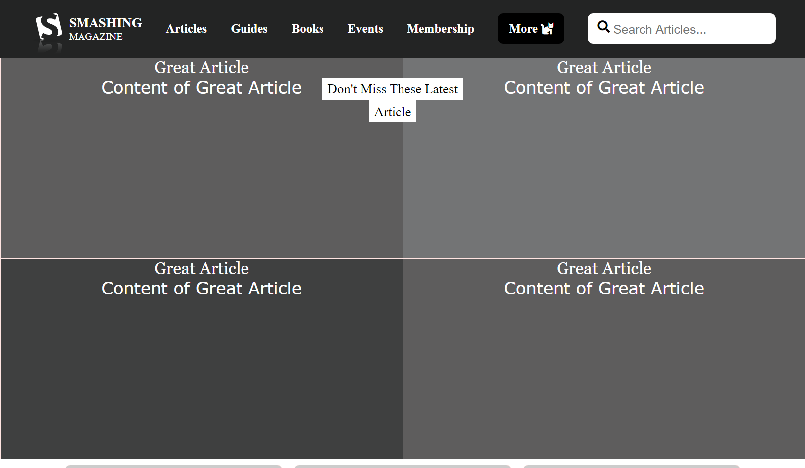

# Heatmap
Fifth project on Microverse course

# Project Name

> Making a Heat Map out of a page.

We described how would look [this](https://www.smashingmagazine.com/) page as if using a Heat Map.

The darker the color is, the most likely is to get visited by a user.

## Built With

- HTML:
- - Using semantic tags like: main, article, footer.
- CSS:
- - Using styling for Grids, Grayscale for most visited parts of the page.
- FONTAWESOME:
- - As a source of Icons.

## Live Demo

Here you will find a Live Demo page, any comment is well recieved.

[Live Demo Link](https://raw.githack.com/MrkarlosM/heatmap/feature-branch/index.html)

## Authors

Please feel free to contact us in any time:

👤 **Carlos Mario **

- GitHub: [@githubhandle](https://github.com/MrkarlosM)
- Twitter: [@twitterhandle](@MrkarlosM)
- LinkedIn: [LinkedIn](https://www.linkedin.com/in/carlos-mario-martinez-b1768355/)

😎 **Abdo Amin**
- GitHub: [@Abdelrhman-Amin](https://github.com/AbdelrhmanAmin)
- Twitter: [@Abdo-Amin](https://twitter.com/AbdoAmi60489112)
- LinkedIn: [LinkedIn](https://www.linkedin.com/in/abdo-amin-ab786a1b0/)

## 🤝 Contributing

Contributions, issues, and feature requests are welcome!

Feel free to check the [issues page](https://github.com/MrkarlosM/heatmap/issues).

## Show your support

Give a ⭐️ if you like this project!
Also advices are well recieved.

## Acknowledgments

- Microverse Team.
- Smashing Magazine.

## 📝 License

This project is [MIT](./LICENSE.md) licensed.
